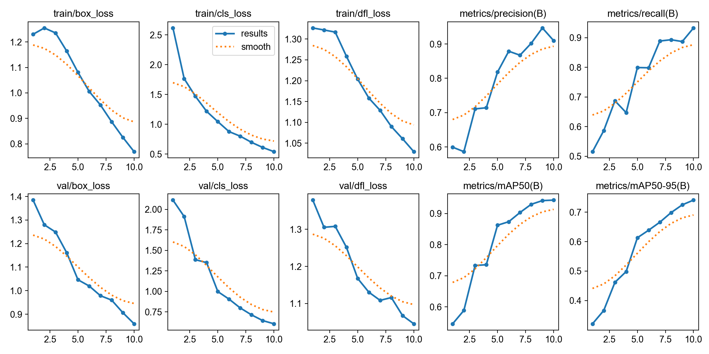
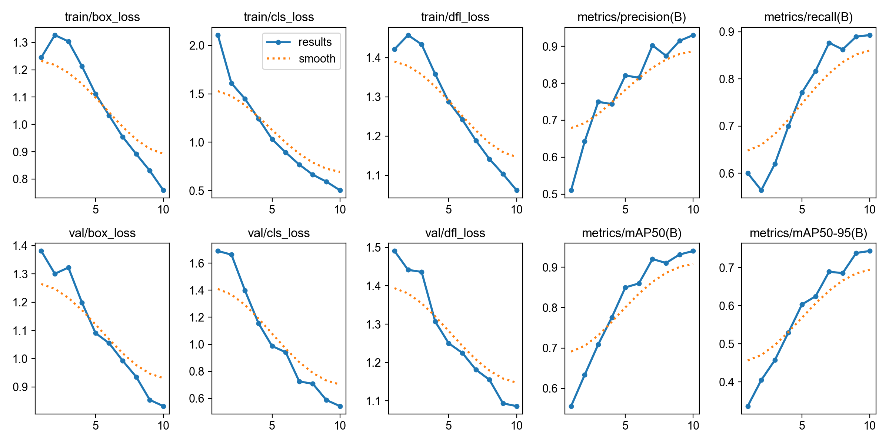
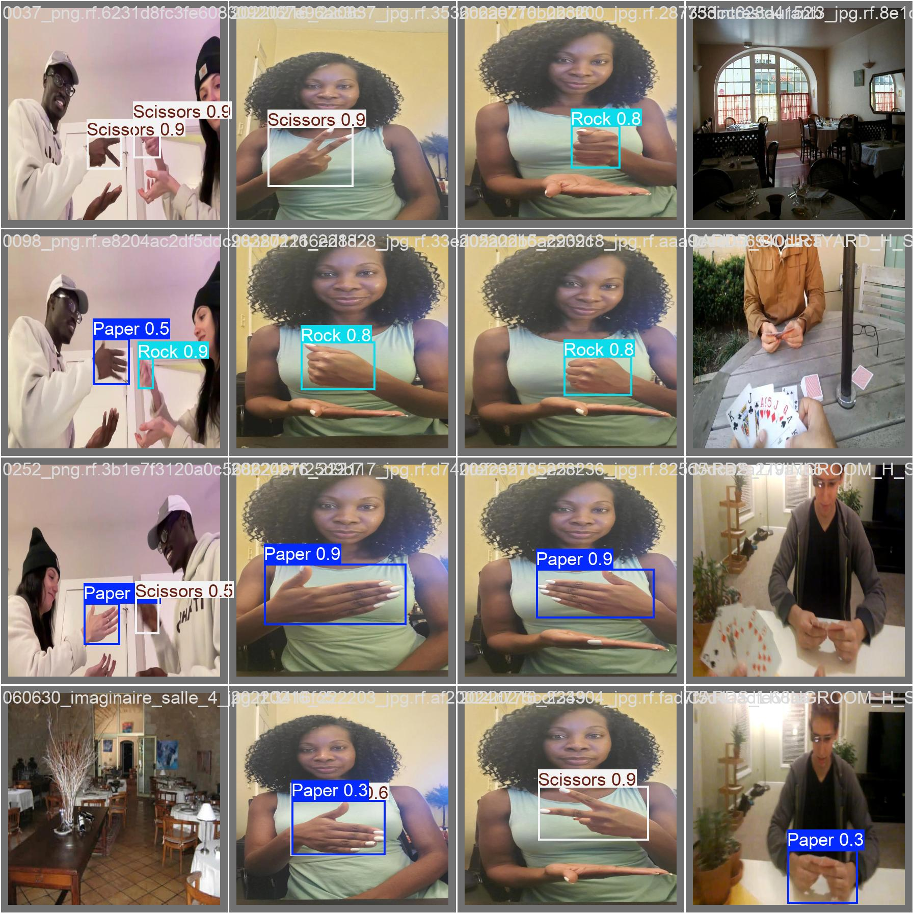

# Rock Paper Scissors Detection: YOLOv8 Performance Analysis

This repository contains a comparative study of YOLOv8 architectures (Nano, Small, and Medium) for detecting hand gestures in a "Rock, Paper, Scissors" game. This project was completed as part of the Final Workshop Assignment.

## 📊 Model Comparison
| Model | mAP50 | mAP50–95 | Precision | Recall | Speed (ms) | Size (MB) |
|-------|-------|----------|-----------|--------|------------|-----------|
| YOLOv8n | 0.943 | 0.742 | 0.910 | 0.933 | 2.2 ms | 6.2 MB |
| YOLOv8s | 0.940 | 0.743 | 0.931 | 0.893 | 4.0 ms | 22.5 MB |
| YOLOv8m | 0.934 | 0.736 | 0.916 | 0.888 | 9.2 ms | 52.0 MB |

*Models trained for 10 epochs, batch size 16, image size 416.*

---

## 📈 Training Results & Visuals

### Training Progress (Loss & Metrics)
The following charts show the convergence of the YOLOv8n model. The steady decline in "val/box_loss" and the sharp rise in "metrics/mAP50" indicate a highly successful training session.



### Comparative Training Results (Small Model)
Below are the training metrics for the YOLOv8s model for comparison.



### Model Predictions (Inference)
This image shows the Nano model successfully identifying gestures (Rock, Paper, Scissors) in the validation set with high confidence scores.



---

## 🧠 Analysis & Discussion

### Accuracy vs. Model Complexity
Surprisingly, **YOLOv8n (Nano)** achieved the highest mAP50 (0.943). While larger models typically offer more depth, they often require more than 10 epochs to converge. The Nano model's efficiency allowed it to reach peak performance rapidly on this specific dataset.

### Speed and Real-time Suitability
The **YOLOv8n** model is the clear winner for real-time applications. With an inference speed of 2.2 ms (>450 FPS), it provides zero-lag detection, essential for interactive gaming.

### Precision vs. Recall
* **YOLOv8s** showed the highest **Precision (0.931)**: It had the fewest false positives (rarely misidentified a gesture).
* **YOLOv8n** showed the highest **Recall (0.933)**: It was the best at finding every hand gesture in the frame, even in varied lighting.

---

## 🛠️ Installation & Usage

### 1. Setup Environment
```bash
# Clone the repository
git clone [https://github.com/jeremiaat/Rock-Paper-Scissors-Detection.git](https://github.com/jeremiaat/Rock-Paper-Scissors-Detection.git)
cd Rock-Paper-Scissors-Detection

# Create and activate virtual environment
python -m venv venv
.\venv\Scripts\activate

# Install dependencies
pip install -r requirements.txt